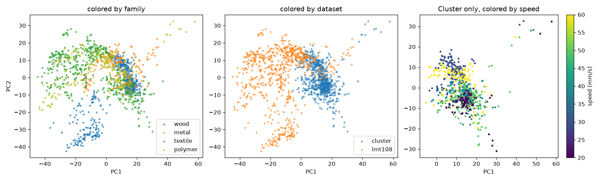
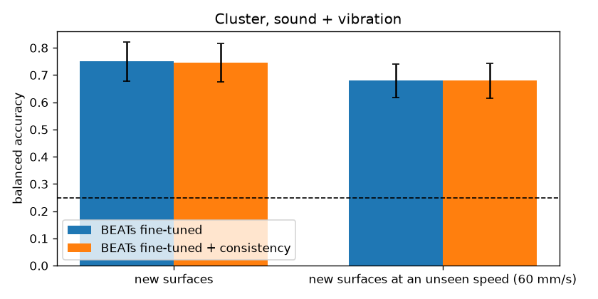
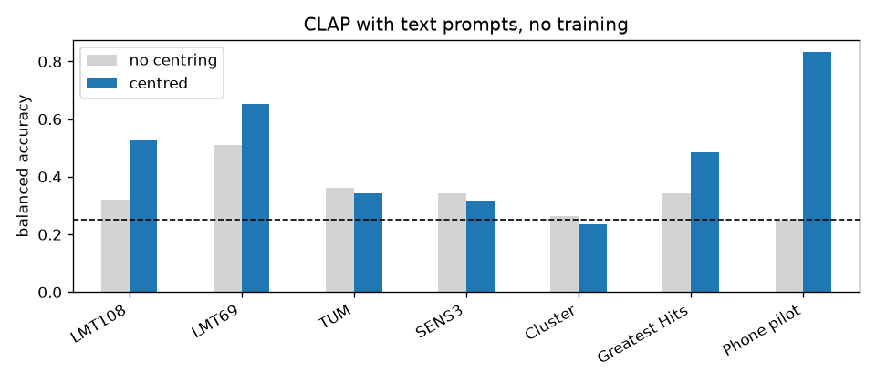

# hear-you-scrape

<p align="center"></p>

*Contact: In Space No One Can Hear You Scrape.*

A surface can look like wood and be plastic. Sliding something on it gives another clue: its sound and its
vibration. We try to say if a surface is **wood, metal, textile or polymer** from a scrape.

The hard part is a **recording setup the model has never seen**: another tool, another sensor, another lab.
We use eight public datasets (steel tips held by hand, a bare finger, a machine, a drumstick in videos) and a
few recordings made with our phones.

Scores are balanced accuracy on surfaces never used for training. Chance is 0.25.
Every experiment, with its number and whether it passed, is in [RESULTS.md](RESULTS.md).

## 1. The datasets differ more than the families

Before any model we looked at the signals: spectrograms, spectra, PCA, clustering. With our two first datasets
together (Cluster and LMT108), a PCA or a clustering finds the **dataset** (ARI 0.80-0.86), not the family (about
0.1). Inside one dataset the families do show up: clearly in LMT108 (wood has a bump at 150-400 Hz), partly in
Cluster (wood and most textiles).

The Cluster vibration also contains lines from the machine (f = 3.5 x speed). There, speed changes the spectrum as
much as the surface does, and the level rises about 5.5 dB each time the speed doubles. Sound and vibration are
almost unrelated (coherence 0.01 to 0.10): they are two different views of the scrape.



## 2. A setup the model knows: it works

On new surfaces of the same setup, an SVM on spectral shapes and a small CNN both reach about 0.74 with
sound + vibration (0.74 and 0.73).

This is also where we tested the idea of our proposal (`velocity_consistency.ipynb`): BEATs fine-tuned on Cluster,
with a penalty when two recordings of the same surface at two speeds get different answers. The penalty changes
nothing: 0.75 with or without it on new surfaces, 0.68 with or without it when the speed of the test (60 mm/s) is
never seen in training. Frozen BEATs with a logistic regression already gives 0.74. An unseen speed costs only
about 0.07, far less than an unseen setup, so the rest of the project studies the change of setup.



## 3. A new setup with no label: it does not work reliably

Trained on Cluster and tested on LMT108 (or the reverse), every model is at chance. We tried about 40 ideas:
domain adaptation, random fake devices, 250 simulated devices, pretrained encoders, an audio language model.
All stay near chance.

The best one needs no training: CLAP compares the sound with sentences like "the sound of scraping wood".
It gives 0.43 on average, fine on some setups and at chance on others.



We locked one test in advance: 184 building materials recorded with a tool we had never looked at.
We got 0.38 for a pass mark of 0.50.

What transfers depends on the **kind of contact**. Families pass only between the two steel tips held by hand.
Materials with the same name find each other between two steel-tip datasets (0.94, chance 0.5), but not between a
steel tip and the machine.

## 4. Training on other setups makes it worse

We fine-tuned CLAP on the other datasets. It gets better on setups it has seen (0.45 to 0.70) and worse on the
one it has not (0.43 to 0.31). The score falls from the first training steps and never comes back.


Nothing we tried fixes it: mixing the old and new weights, editing the weights, many augmentations, unfreezing
the layers step by step, training on 1 to 4 setups, adding 200 to 20000 synthetic scrapes, a lower learning rate.

## 5. Two labeled surfaces per family are enough

If we label two surfaces per family on the new setup and train a small classifier on frozen BEATs vectors, we get
0.64 on a locked test (0.42 with no label). Data from the other setups does not help here either: on our three first
setups, 0.56 with their own labels alone and 0.48 with the other setups added.


Two things help more: choosing which surfaces to label with k-means, and adding taps to the scrapes. With 8 to 12
labeled surfaces we reach 0.61 to 0.91 depending on the dataset. This last part still needs a locked test.

## 6. Friction crosses setups better than families do

Instead of a family we predict a measured quantity. A model trained on steel-tip vibrations ranks the surfaces
of a bare-finger dataset by friction (0.59 and 0.52, rank correlation), and again on a second one (0.87 on 10
textures). No label of the new setup is used.


It has clear limits: it fails with sound (0.28 and 0.03), and on the machine dataset the sign is inverted (-0.52).
The model mostly follows the vibration level and the speed of the gesture. This part is exploratory.

## Notebooks

| Notebook | What it does |
|---|---|
| `data.ipynb` | downloads the datasets and cuts the recordings into short windows |
| `signals.ipynb` | spectrograms, machine noise, variance by factor, PCA, clustering, effect of speed, sound-vibration coherence |
| `known_setup.ipynb` | new surfaces of a setup the model knows |
| `new_setup.ipynb` | a new setup with no label |
| `few_labels.ipynb` | a new setup with a few labeled surfaces |
| `fine_tuning.ipynb` | fine-tuning CLAP on the other setups |
| `synthetic.ipynb` | synthetic scrapes as training data |
| `friction.ipynb` | predicting friction instead of a family |
| `velocity_consistency.ipynb` | the proposal's experiment: BEATs fine-tuned with and without a penalty for answering differently at two speeds |

Heavy steps save their output in `cache/`, so a notebook is fast the second time.
Tables and figures go to `results/`.

## Weights

The fine-tuned CLAP models of part 4 are on Hugging Face:
[lchappuis/hear-you-scrape-clap](https://huggingface.co/lchappuis/hear-you-scrape-clap) (14 files, for research).
They are worse than the original CLAP on a setup they have not seen: we share them so that others can study why.

## Data

Not in the repo. `data.ipynb` gets it from the authors:
[Cluster](https://doi.org/10.6084/m9.figshare.29438288),
[LMT108 and LMT69](https://zeus.lkn.ei.tum.de/downloads/texture/),
[HaTT](https://repository.upenn.edu/handle/20.500.14332/30085),
[TUM building materials](https://mediatum.ub.tum.de/1474014),
[SENS3](https://www.sens3.net/surfaces),
[Devillard 2025](https://doi.org/10.6084/m9.figshare.26965267),
[Greatest Hits](https://andrewowens.com/vis/hits.html).

## Run

```
uv sync
uv run jupyter lab
```
